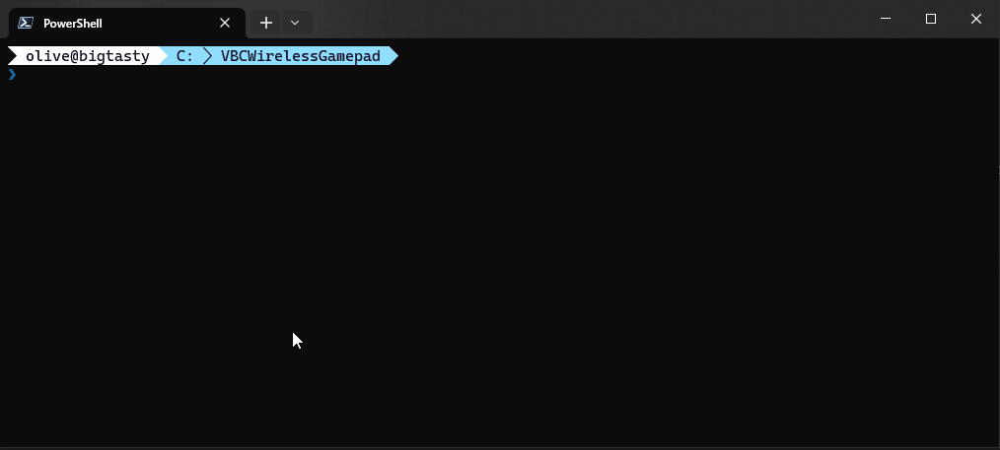
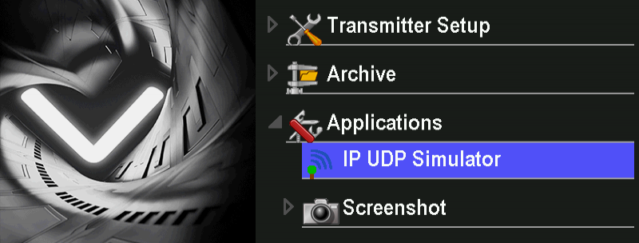
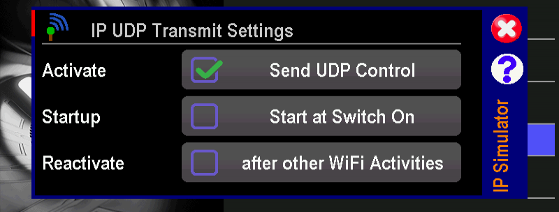

# VJoystick

VJoystick enables wireless control of a generic Windows game controller using a VBarControl Touch, allowing it to be used with a wide range of flight simulators and games. While some simulators natively support the protocol developed by Mikado, they remain in the minority. VJoystick fills this gap by providing a versatile solution that can be used with any simulator or game that supports Windows joysticks.

## Installation

1. Build the solution or download release from [here](https://vjoystick.vercel.app/docs/installation/)
2. Run `VJoystick.exe`  
   
3. Start IP UDP Simulator App on your VBCt  
   
4. Activate **Send UDP Control**  
   
5. VJoystick will pickup all the inputs from your VBC and forward it to the Windows joystick. 
6. Setup the game controller in your favorite simulator / game and have fun.
